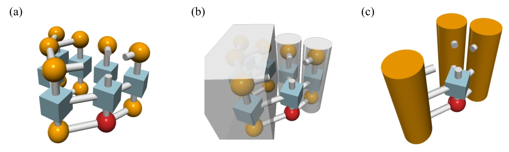

Draw tensor network diagrams using jupyter notebook and vpython. The notebooks are in the `notebooks` directory.

Install the dependencies in requirements.txt, and run `jupyter notebook`. Enjoy!

Sample images

Note that the diagrams won't show properly in GitHub. In binder, you can view them after running the cells.
